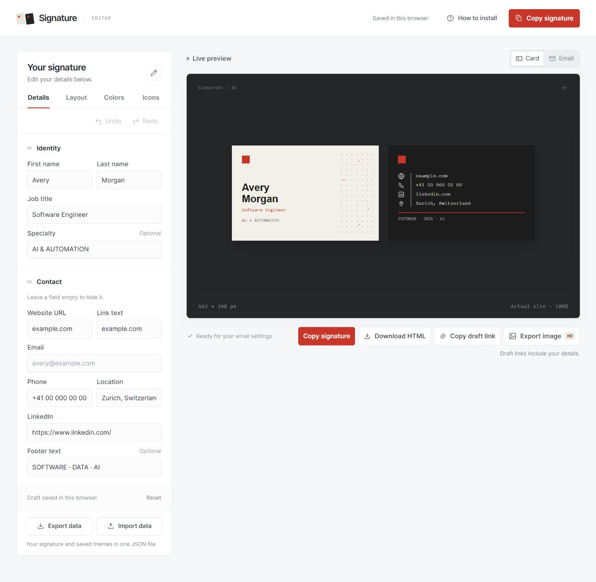
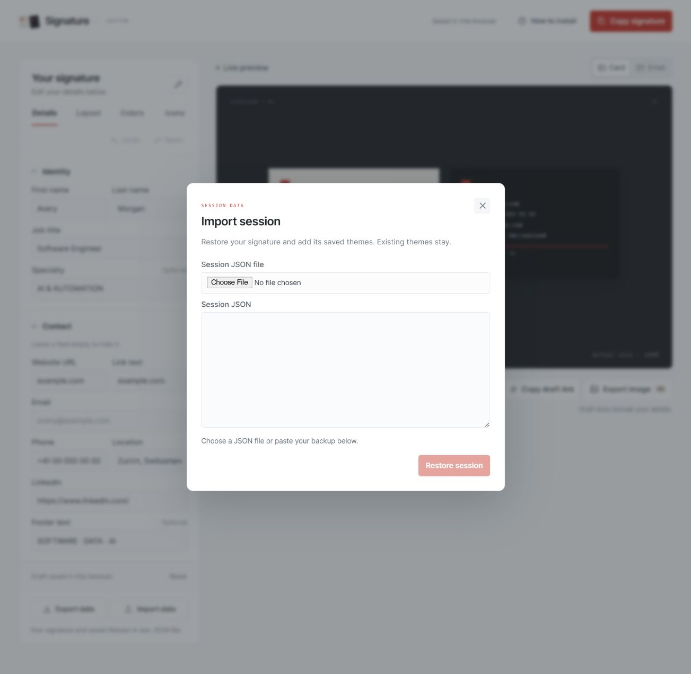

# Signature editor

A static email signature editor with a live preview, editable contact details, and HTML export. The public example is **Avery Morgan**. Your own details stay in your browser unless you copy, download, or deliberately share them.



## Run locally

Install Node.js 22 or newer, then run these commands in this folder:

```sh
npm start
```

Open **http://127.0.0.1:4173**. No package install is required: the app and scripts have no third-party dependencies. Stop the server with Ctrl+C. `signature.html` is also an editor entry point.

If that port is occupied, set `PORT` before starting. In PowerShell: `$env:PORT='4186'`, then `npm start`. The server prints its actual address.

The local server serves only the app files and the eleven approved PNG assets. It does not serve this README, handoff notes, `.git`, `.private`, or arbitrary files from the folder.

## Make your signature

1. Replace the example details. A portfolio website can replace an email address; other contact fields can be left blank.
2. Choose the paired or stacked cards and adjust the card width and height. The preview and exported signature use the same renderer.
3. The image base is prefilled with the original public asset folder. To use your own host, open Layout → Advanced settings and set a public HTTPS URL for the `sig` folder. Recipients need a publicly reachable image URL; the editor's local preview uses bundled artwork for the default base.
4. Copy the signature with the editor's copy action, then paste it into Gmail's signature settings. If clipboard access is denied, follow the editor's manual-copy fallback. If your browser blocks a download, open the editor in Chrome or Edge and retry.
5. In Gmail, choose which signature is used for new messages and replies, then save changes.
6. Send an actual test message and inspect the received message on desktop and mobile. Check images, spacing, and links before relying on it.

Side-by-side cards export at 662 × 208 px by default. Stacked cards export at 321 × 436 px and suit narrower email views. Preview scaling helps the editor fit your screen; it does not resize the exported signature. The title is free text: use your current role and update it when the new role begins.

## Card colors and saved themes

Open **Colors** to choose the name-card background, contact-card background, and accent. Use the color pickers or type six-digit hex codes. The same colors appear in the preview, copied HTML, downloads, and draft links. Text automatically switches to a readable color when necessary, including when an accent is too close to its background.

Start with Original, Midnight, or Spruce, or choose your own colors. Enter a unique theme name and click **Save new**. To revise a saved theme, select it, change its colors or name, and click **Update selected**. **Delete** removes the saved theme while leaving the current card colors in place; an Undo action restores it.

Themes persist in this browser and store only the three colors and a name. Applying a theme does not replace your contact details, job title, card size, or arrangement. Clearing browser data removes saved themes. Draft links include the current colors, but not your theme library. Older drafts automatically use the original card colors.

## Contact icons

Open **Icons** to choose a globe, envelope, phone, LinkedIn mark, location pin, or **None** for each contact row. The selector shows the selected artwork. None hides only the icon; leaving a contact field empty hides the entire row. Choices persist with the signature draft and travel in draft links and HTML exports. Color themes leave icon choices unchanged.

The signature uses transparent PNG files in `sig/`. The renderer checks the contact-card background and automatically chooses cream or charcoal artwork with at least 3:1 calculated contrast. No solid backing boxes or CSS filters are needed in email. Publish all eleven PNG files with the demo, including the five `*-dark.png` variants, and keep the image base pointing to that public folder. Icon selectors choose from this bundled set; they do not upload files.

To regenerate the dark variants after changing the original icons, run `node scripts/prepare-icons.mjs`. This dependency-free script preserves the original dimensions and every alpha byte while changing the ink to charcoal.

## Undo and redo

Use **Undo** and **Redo** above the fields to move through text, color, icon, dimension, layout, theme-application, reset, and same-page draft-import changes. Continuous typing in one field is grouped into a step. Invalid edits can be undone too. A new edit after Undo clears the abandoned Redo branch.

History holds up to 100 steps in the current page session. Reloading the page clears history but retains the saved draft. Saving or deleting named themes uses the theme library's own controls; draft history does not change that library.

## Back up and restore a session

Click **Export data** below the editor, then **Download JSON**. **Copy JSON** is available too. The file contains your signature details, colors, icons, card dimensions, saved themes, active editor tab, preview view, and image-export settings. Keep it somewhere private: contact details are readable in the file.

On another browser or device, open **Import data**, choose the JSON file or paste its contents, and click **Restore session**. Import replaces the current signature and adds the saved themes. Existing themes stay; duplicates are reused and conflicting names receive an imported suffix. Invalid files show an error before anything changes. Older plain signature-draft JSON files are also accepted.

The JSON file works between the local editor and the hosted demo. Browser storage is separate for each site address, so export before moving. A restored signature can be undone in the current tab; that Undo does not remove imported themes. Undo history itself is not included in a backup.



## Export an HD image

Click **Export image · HD** beside the preview, then choose **2×**, **4× HD**, or **6× Maximum**. The dialog shows the PNG before downloading and its exact dimensions. The default paired signature exports at 2648 × 832 px at 4×; stacked layouts and custom card sizes are respected. Choose a transparent or white gap between the cards.

Click **Download PNG**, or right-click the generated preview and save the image. The PNG contains only the cards. Images do not preserve clickable links; use Copy signature for linked email signatures. A blocked browser download is reported as a request, not a confirmed file save.


Rendering uses the same table HTML as the live preview, with its image assets embedded before rasterization. Default artwork loads locally, so PNG export works before the demo is published. A custom image host must allow cross-origin reads and serve valid image files; missing or corrupt artwork stops export with an error. Text is rendered at the selected resolution; original raster artwork retains its source detail. Checked in the Chromium-based Codex browser; other browser engines need their own verification. See [MDN's SVG image restrictions](https://developer.mozilla.org/en-US/docs/Web/SVG/Guides/SVG_as_an_image) for the embedding requirement.

Gmail setup and its 10,000-character limit are described in [Google's signature instructions](https://support.google.com/mail/answer/8395?hl=en).

Keep a downloaded copy somewhere private if you need a backup. Browser data can be cleared, and drafts belong to the browser and site address where you created them. This app has no account or server-side draft storage. Local drafts are convenient storage, not encryption: someone with access to your browser profile can read them.

## Publish your own demo

The repository includes a GitHub Pages workflow. Before your first deployment:

1. Review the files you intend to commit. Public source should contain only example values; do not commit a personal export or backup.
2. In the GitHub repository, open **Settings → Pages → Build and deployment → Source**, and select **GitHub Actions**.
3. Push the reviewed source to `main`. The workflow runs the tests, builds the public files, and deploys the `dist` artifact. You can also run it from the Actions tab with **Run workflow**. Pull requests run tests and build without deploying.
4. Open the Pages address reported by the successful deployment. The public images will be under that address's `sig/` path. Use that full HTTPS path as the image base, and open `dots.png` at that path to check it loads.

For example, a project published at `https://YOUR-USERNAME.github.io/YOUR-REPOSITORY/` uses `https://YOUR-USERNAME.github.io/YOUR-REPOSITORY/sig` as its image base. Keep the site and image paths stable so signatures already sent can still load their assets.

For updates, back up your session, pull the latest source, run the checks below, and restart the local server. After a Pages deployment succeeds, refresh the hosted editor. If old controls remain, use a hard refresh. Import your JSON when moving between the local and hosted addresses. If saving is blocked by browser settings or storage limits, the editor reports that the session is only in the current tab; export it before closing.

The Pages workflow follows [GitHub's custom workflow documentation](https://docs.github.com/en/pages/getting-started-with-github-pages/using-custom-workflows-with-github-pages). The local build scripts do not push changes, alter repository visibility, or rewrite history.

## Privacy and existing history

**The old commits in this repository contain personal contact information. Replacing the current files does not erase that history.** A public source repository exposes its committed history even when the deployed site contains only generic examples. `.gitignore` does not remove files that were already tracked.

Before making this repository public or pushing its existing history to a new public repository, decide whether you want to retain that history. A fresh repository containing only the reviewed generic files is one option. Rewriting history is a separate operation that can disrupt existing clones and does not remove copies already made elsewhere. This project does not do it automatically.

The build publishes only its explicit app and PNG allowlist. Keep private notes and exports under the ignored `.private/` folder, or outside the repository. When you paste the signature into email, its contact details become part of that message. Loading externally hosted images also contacts their host, subject to the email client's image proxy behavior.

## Checks and project files

```sh
npm test
npm run build
```

Tests check safe input handling, optional fields, Unicode values, declared dimensions, export size, undo/redo, icon contrast and transparency, PNG export validation, session-file round trips and theme merging, storage recovery, and the public-file boundary. The build replaces `dist` with the ten app files and eleven PNG assets listed in `scripts/public-files.mjs`; documentation and repository metadata are excluded.

| File | Purpose |
| --- | --- |
| `index.html`, `signature.html` | Editor entry points |
| `app.js`, `editor.css` | Editor behavior and styling |
| `signature-core.js` | Shared validation, HTML rendering, and plain text output |
| `editor-history.js` | Bounded session undo/redo snapshots |
| `signature-image.js` | HD PNG rendering, preview and download dialog |
| `session-data.js`, `session-controls.js` | Validated session files, theme merging, and import/export dialog |
| `signature-only.html` | Generic standalone signature example |
| `sig/` | Hosted decorative grid and contact icons |
| `scripts/` | Dependency-free local server and public build |
| `tests/` | Node tests |
| `.github/workflows/pages.yml` | Tests, build, and GitHub Pages deployment |

The signature uses tables and inline styling to suit email. Email clients can still change fonts, colors, spacing, and image loading. Browser screenshots and automated tests verify the editor and generated markup; they **do not prove that Gmail preserves the signature after pasting or sending**. A real Gmail recipient test remains the final compatibility check. See `PROGRESS.md` for the latest checks actually completed.
