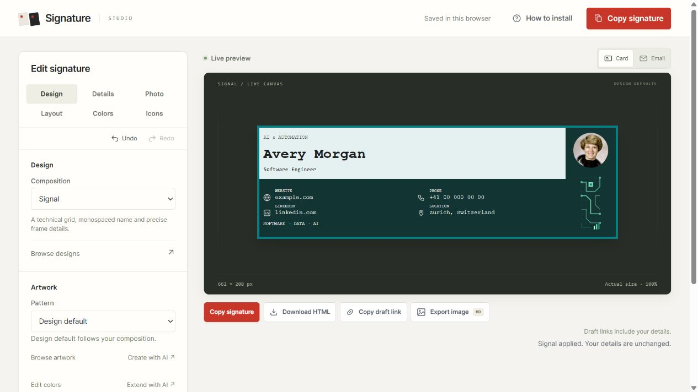
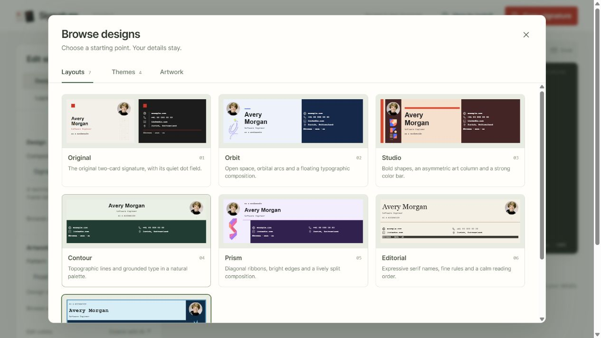
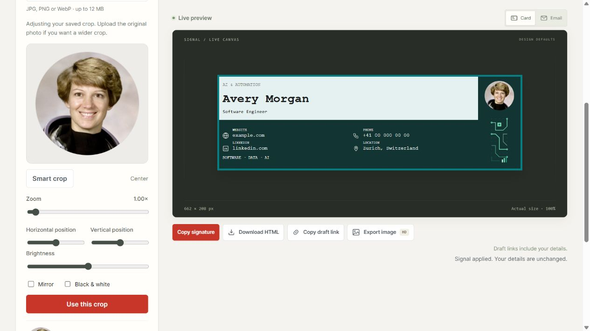
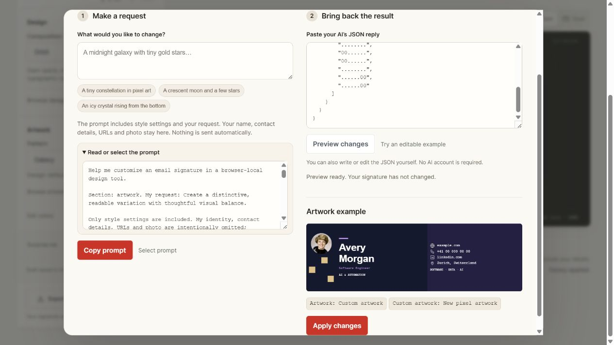
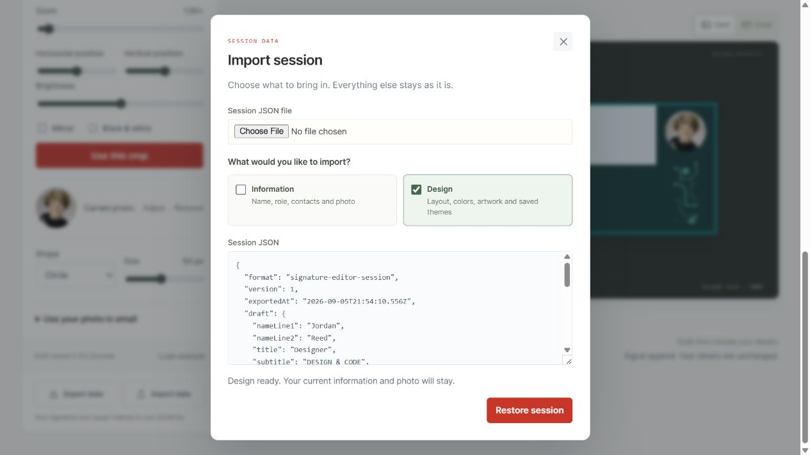
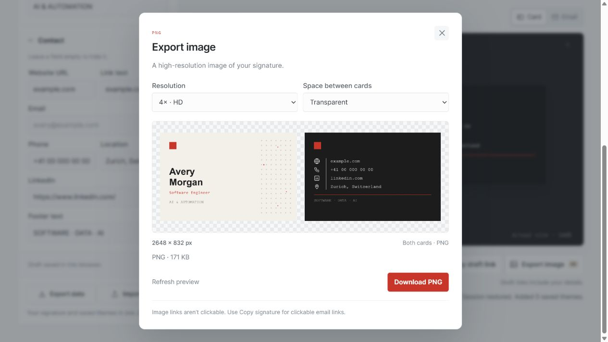

# Signature Studio

A browser-local email signature editor with seven compositions, four fantasy themes, private photo cropping, and HTML or high-resolution PNG export. Customize each section directly or bring back a validated JSON proposal from your own AI. Start with the **Avery Morgan** example and keep the result in your browser.

[Open the published demo](https://ademord.github.io/gmail-signature/) · [Tests and deployment](https://github.com/Ademord/gmail-signature/actions/workflows/pages.yml) · [Design roadmap](docs/DESIGN-ROADMAP.md)



This README describes the implemented source. See [PROGRESS.md](PROGRESS.md) for the latest browser, release, and email checks; feature availability does not imply that every release check has passed. Browser verification uses the Codex in-app browser. Gmail paste/send verification remains blocked on an authenticated send test.

## Run locally

Install Node.js 22 or newer, then run:

```sh
npm start
```

Open **http://127.0.0.1:4173**. No `npm install` is needed. The server and build use Node's built-in modules; the app includes a vendored MIT-licensed Pico face detector and model. No cloud service is needed for photo cropping. Stop the server with Ctrl+C. `signature.html` is also an editor entry point.

If that port is occupied, set `PORT` before starting. In PowerShell: `$env:PORT='4186'`, then `npm start`. The server prints its actual address. Use the server instead of opening the editor through `file://`, so the photo worker and model can load.

The server serves only the app, artwork, and detector files listed in `scripts/public-files.mjs`. It does not serve this README, handoff notes, `.git`, `.private`, or arbitrary files from the folder.

## Choose a design

The main workspace keeps the current signature in view. In **Design**, use the Composition selector for a quick change, or click **Browse designs** to open the library with **Layouts**, **Themes**, and **Artwork** tabs. Choosing a card returns to the working preview. **Browse artwork** opens the artwork tab directly. The six new designs compose the full signature area; **Original** retains its two-card arrangement.



| Design | Composition |
| --- | --- |
| Original | Original name and contact cards with a dot field |
| Orbit | Three-part portrait/artwork, identity, and contact band |
| Studio | Asymmetric geometric sidebar, bold name, contrasting contact area |
| Contour | Centered identity above a contact grid with organic contour lines |
| Prism | Diagonal artwork rail beside the identity and inset contacts |
| Editorial | Full-width serif masthead, fine rule, contact columns |
| Signal | Framed terminal-style header and labeled contact grid |

A design applies its composition, palette, and default pattern while preserving personal details. Choose a different pattern independently, use **None** to remove it, or return to **Design default**. Six quick palettes and **Swap surface colors** are in **Colors**; **Edit colors** in Design opens that tab. **Surprise me** combines a design, palette, and pattern; **Undo** returns to the previous choice. **Reset design** restores the selected composition's default palette and pattern.

The **Themes** tab in Browse designs combines those compositions with four additional palettes and PNG motifs:

| Theme | Starting composition | Artwork |
| --- | --- | --- |
| Galaxy | Orbit | Violet spirals and distant stars on midnight blue |
| Starlight | Editorial | Golden constellations on deep blue |
| Moonlight | Contour | Sailor Moon-inspired crescent, ribbons, and pink jewels |
| Frost Crown | Signal | Frozen Throne-inspired ice crown and glowing runes |

These themes use the seven existing compositions; they are not four additional layout engines. Apply one, then mix its colors and pattern with another composition. Your personal details carry across.

In **Layout**, choose **Wide** or **Tall** and adjust width and height. Original places its cards beside each other or stacks them; the new designs use the full wide or tall canvas. The default overall size is 662 × 208 px in Wide and 321 × 436 px in Tall. Preview scaling fits the editor to the screen without resizing the exported signature. Check the displayed dimensions before copying into a narrow email view.

## Add details and a photo

In **Details**, replace the example name, role, subtitle, contacts, and tags. A portfolio website can replace an email address. Empty optional fields remove their contact rows.

In **Photo**:

1. Choose a JPG, PNG, or WebP image, up to 12 MB and 60 megapixels.
2. Face detection runs on this device. **Smart crop** frames a detected face with room for the head and shoulders. If several faces are found, use **Choose a face**.
3. Drag to reposition, use position sliders or arrow keys, and adjust zoom. **Center** starts from the middle. Brightness, **Black & white**, and **Mirror** modify the crop.
4. Click **Use this crop**. Choose a circle, rounded square, or square, and a display size from 40 to 96 px.



The saved crop is a **384 × 384 JPEG** generated in the browser, with the original metadata removed. The local draft, PNG export, and session JSON include that crop. They do not include the original full-size file or unfinished crop adjustments. Face detection finds regions, not identities; small, obscured, or side-on faces may be missed. Manual cropping remains available when no face is found or detection cannot run.

Click **Adjust** beside the saved photo to reopen that crop, including after reloading or restoring a session. It can be cropped and adjusted again. A wider view requires uploading the original photo again because pixels outside the saved square are not retained.

Pico, its model, and the MIT license are bundled in `vendor/`. The worker uses local assets and does not send photos to a detection service. See [detector provenance and license notes](vendor/README.md).

### Include the photo in HTML email

A local upload is ready for preview and PNG export. For a clickable HTML signature:

1. Open **Use your photo in email** and click **Download cropped photo**.
2. Host that square crop on your website or an image host with a stable, publicly readable HTTPS image URL.
3. Paste it into **Hosted cropped photo URL**, then click **Use photo URL**.

The editor checks that the URL loads a square image. It does not upload or publish the photo. Using a URL replaces the embedded crop in the draft, so download it first if you want to keep it. A local file, temporary browser URL, private sharing page, or expired link will not work for recipients.

**Copy signature** and **Download HTML** require a hosted URL when an uploaded photo is present. Alternatively, remove the photo or use PNG export. Draft links cannot carry uploaded photo data; use **Export data** to transfer that draft. A custom host must also allow cross-origin reads for PNG export; email image loading and browser export are separate requirements.

## Copy into Gmail

1. Check the **Card** and **Email** previews.
2. If needed, open **Layout → Advanced settings** and set the image base to a public HTTPS folder containing the bundled `sig/` assets. Local preview uses bundled artwork for the default base. A portrait uses its separate photo URL.
3. Click **Copy signature**, then paste the formatted signature into Gmail. If clipboard access is denied, follow the manual-copy fallback. **Download HTML** provides a file you can open to select and copy.
4. In Gmail, go to **Settings → See all settings → Signature**, choose defaults for new messages and replies, then **Save Changes**.
5. Send a test message and inspect the received email on desktop and mobile. Check images, text, spacing, and links.

Google documents a **10,000-character signature limit**, including images. The editor checks generated HTML size, but Gmail may change the content during paste. See [Google's signature instructions](https://support.google.com/mail/answer/8395?hl=en) and [signature troubleshooting](https://support.google.com/mail/answer/11468381).

Output uses tables, inline styling, real text, and normal links. Email clients may change fonts, colors, spacing, photo corners, or image loading. A browser preview does not prove Gmail preserves a signature after pasting and sending. Received-message testing remains the final compatibility check.

## Colors, patterns, and icons

Open **Colors** to edit the two surface colors and accent with pickers or six-digit hex codes. Their positions depend on the design. Text switches to a readable ink when necessary, including when the accent is too close to its background.

The Colors tab includes six quick palettes and a saved-theme selector with Original, Midnight, and Spruce. To save custom colors, enter a unique name and click **Save new**. Select a saved theme and use **Update selected** to revise it. **Delete** leaves the current colors in place; its Undo action restores the theme.

Saved themes contain **only a name and three colors**, not the design, pattern, photo, or contacts. They persist in this browser. Applying a theme preserves other signature details. Draft links include current choices but not the theme library; session JSON includes both.

The ten generated decorative motifs and Original's dot field use fixed inks and transparent PNGs. Their colors do not change with the accent. Arbitrary custom colors can obscure some decorative strokes. Choose another pattern or **None** when needed. The AI helper also accepts small custom pixel-art recipes, rendered as native email table cells without requiring a new image host.

In **Icons**, select a globe, envelope, phone, LinkedIn mark, location pin, or **None** per contact row. None hides only the icon. The renderer chooses cream or charcoal artwork for the actual surface, using a calculated 3:1 contrast threshold. Custom icon uploads are planned.

Publish all `sig/` assets, including five `*-dark.png` icons, the six composition motifs, and the four fantasy-theme motifs. Regenerate the icon variants and all ten motifs with:

```sh
node scripts/prepare-icons.mjs
node scripts/prepare-patterns.mjs --proof
node scripts/prepare-patterns.mjs --check
```

The pattern check covers all ten generated motifs. It reads real PNGs and verifies dimensions, transparency, antialiased edges, uniqueness, and deterministic regeneration. Those motifs have 304 × 728 native pixels, equivalent to 4× detail at 76 × 182 px. The original `dots.png` is a separate bundled asset.

## Extend a section with your own AI

Design, artwork, layout, colors, details, icons, and photo format each have an AI helper button. Describe a change, read the generated prompt, copy it to an AI you choose, and paste its JSON reply back. The editor does not call a model, require an API key, or train/fine-tune one. You can use **Try an editable example** and edit JSON yourself without any AI account.

Click **Preview changes** to validate the reply and inspect the candidate signature and changed fields. Your draft stays unchanged until **Apply changes**; one **Undo** restores the previous signature. If the draft changes after preview, the proposal must be previewed again.

Default prompts omit your identity, contacts, URLs, and photo. The request you type is included. The Details helper uses fictional example wording unless you select **Include my current text and contact details in the prompt**. The photo helper changes only shape and display size; crop and brightness controls remain local.

Custom layouts choose one of six base compositions, one of three name-font families, and left or centered identity alignment. Custom artwork uses a bounded pixel grid and up to eight colors. This is a structured editing contract, not arbitrary HTML/CSS or unlimited AI image generation. The complete signature still has to fit the HTML size budget.



See [AI extensions: workflow, complete contract, and examples](docs/AI-EXTENSIONS.md).

## Undo, backups, and draft links

**Undo** and **Redo** cover signature edits, including committed photo changes. Continuous typing in one field is grouped into a step. Invalid edits can be undone. A new edit after Undo clears the abandoned Redo branch. History holds up to 100 steps per page session; reloading clears history but retains the saved draft.

Click **Export data**, then **Download JSON** or **Copy JSON**, to save your signature, applied crop or hosted photo URL, design choices, themes, editor tab, preview view, and image-export settings. The file contains readable contact details and may include your photo; keep it private.

On another browser or device, use **Import data**, choose a JSON file or paste its contents, then choose what to import before clicking **Restore session**:

| Selection | Imported | Preserved |
| --- | --- | --- |
| Information only | Name, role, contacts, footer wording, and photo data/URL | Current layout, colors, artwork, icons, photo format, saved themes, and view settings |
| Design only | Layout, colors, artwork recipes, icons, photo shape/size, image base, saved themes, and view settings | Current identity, wording, contacts, and photo data/URL |
| Both | The complete signature and imported design settings | Existing saved themes are retained and merged |

Both options start selected; at least one is required. Imported themes are merged when Design is selected: duplicates are reused and conflicting names receive an imported suffix. The full file and resulting combined signature must validate before anything changes. Older plain draft JSON is accepted too. Recognizable pasted code fences, copied Markdown URL wrappers, and an escaped `@` in an email can be cleaned; the dialog reports those repairs and still applies normal validation.

A restored signature can be undone in the current tab; that Undo does not remove imported themes. Undo history is not included in backups. Browser storage belongs to each site address, so export before moving between local and hosted editors.



**Copy draft link** includes signature details and a hosted photo URL. Anyone with the link can read them. It excludes saved themes and is unavailable for drafts containing an embedded photo; use session JSON for those.

## Export an HD image

Click **Export image · HD** and choose **2×**, **4× HD**, or **6× Maximum**. The dialog previews the PNG and its exact dimensions. The default Wide size produces 2648 × 832 px at 4×. Tall layouts and custom sizes are respected. Original can use a transparent or white gap between its cards; the new designs fill one composed canvas.

Click **Download PNG**, or right-click the preview to save it. PNG contains the signature and applied photo but no clickable contact links. A download request is reported as a request; the browser controls where and whether the file is saved.



Image export uses the same table HTML as the preview and embeds assets before rasterization. Bundled artwork and uploaded crops render locally. Missing, corrupt, or unreadable images stop export with an error. Custom hosts must allow cross-origin reads. Text renders at the chosen resolution; raster artwork and the 384 px photo retain their native detail. A larger export does not invent detail in those images.

Codex in-app browser checks include verified downloaded JSON and PNG files; exact evidence is recorded in [PROGRESS.md](PROGRESS.md). Other browser engines need separate verification. See [MDN's SVG image restrictions](https://developer.mozilla.org/en-US/docs/Web/SVG/Guides/SVG_as_an_image) for the embedding requirement.

## Publish and update

The GitHub Pages workflow supports this deployment path:

1. Review intended public files. Keep personal exports, photos, and private notes out of the source and build.
2. Open repository **Settings → Pages → Build and deployment → Source** and select **GitHub Actions**.
3. Push reviewed source to `main`. The workflow tests, builds `dist`, and deploys. **Run workflow** also starts a run. Pull requests test and build without deploying.
4. Open the reported Pages address. Confirm the editor, artwork, icons, and detector load. Open `sig/dots.png` and a new `sig/pattern-*.png` URL directly.

A site at `https://YOUR-USERNAME.github.io/YOUR-REPOSITORY/` uses `https://YOUR-USERNAME.github.io/YOUR-REPOSITORY/sig` as its image base. Keep image paths stable for previously sent signatures. Publish vendor files and their license; face detection requires its model.

For updates, export your session, pull the latest source, run the checks below, and restart the server. After Pages deploys, refresh the hosted editor; hard-refresh if old controls remain. Import JSON when moving between site addresses. If storage is blocked or full, export the current session before closing.

The workflow follows [GitHub's custom Pages workflow documentation](https://docs.github.com/en/pages/getting-started-with-github-pages/using-custom-workflows-with-github-pages). Local build commands do not push changes, change visibility, or rewrite history.

## Privacy and existing history

Drafts and uploaded crops stay in this browser unless you copy, download, export, or deliberately share them. There is no account or server-side draft storage. Local storage is not encryption: someone with access to your browser profile can read it. Clearing browser data removes drafts and saved themes.

**The old commits in this repository contain personal contact information. Replacing the current files does not erase that history.** Public source exposes committed history even when the deployed site contains only generic examples. `.gitignore` does not remove already-tracked files.

Before making this repository public or pushing its history to a new public repository, decide whether to retain it. A fresh repository containing only reviewed generic files is one option. Rewriting history is separate, can disrupt clones, and does not remove existing copies. This project does not do it automatically.

The build publishes only its explicit allowlist. Keep private notes, original photos, and exports under ignored `.private/` or outside the repository. Pasting a signature into email shares its details. A publicly hosted portrait is accessible at its URL; loading hosted images contacts their host, subject to the email client's image proxy behavior.

## Checks and architecture

```sh
npm test
node scripts/prepare-patterns.mjs --check
npm run build
```

Tests cover validation and dimensions, design rendering, undo/redo, photo crop geometry and file limits, icons, PNG export, session restore, storage recovery, and the public-file boundary. The seven exported AI examples have also been checked through proposal validation and actual rendering. Detector checks have used a NASA portrait fixture and a multi-face composite; browser smart cropping has been observed. [PROGRESS.md](PROGRESS.md) records exact current evidence, test counts, failures, release status, and received-email coverage.

The build replaces `dist` with the 44 files in `scripts/public-files.mjs`, including the design browser, collection module, three AI-helper files, four fantasy assets, and licensed detector. Documentation, test fixtures, and repository metadata are excluded.

| File | Purpose |
| --- | --- |
| `index.html`, `signature.html` | Editor entry points |
| `app.js`, `editor.css` | Studio controls, gallery, preview, persistence |
| `signature-core.js` | Validation, measured layouts, HTML and plain text |
| `design-collections.js` | Four fantasy-theme starting points |
| `library-controls.js`, `library.css` | On-demand layout, theme, and artwork browser |
| `ai-extension-core.js`, `ai-extension-controls.js`, `ai-extension.css` | Scoped prompts, JSON validation, proposal preview and apply |
| `portrait-core.js`, `portrait-controls.js`, `portrait.css` | Photo preparation, crop UI, hosted-photo handoff |
| `portrait-worker.js`, `vendor/` | Detector, model, provenance, MIT license |
| `editor-history.js` | Bounded undo/redo |
| `signature-image.js` | PNG generation, preview, download |
| `session-data.js`, `session-controls.js` | Session files and theme merging |
| `signature-only.html` | Generic standalone example |
| `sig/`, `scripts/`, `tests/` | Artwork, build/server/generation scripts, tests |
| `.github/workflows/pages.yml` | Tests, build, Pages deployment |

[The roadmap](docs/DESIGN-ROADMAP.md) separates implemented work from planned compact layouts, brand kits, hosting integration, broader typography controls, custom icons, and an email compatibility matrix.
