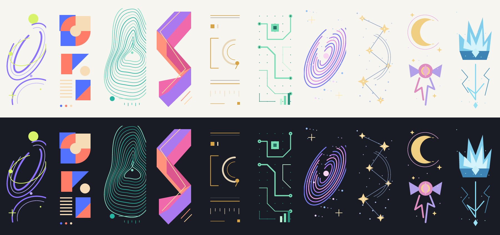

# Signature Studio roadmap

The current source reorganizes the editor into four tabs, adds direct previous/next layout and artwork selection, and moves less frequent controls into closed disclosures. It retains the Plum starting palette, eighteen color palettes, warm stone editor, Desktop/Mobile Email preview widths, flowing artwork, and side-detail editor. The seven compositions, private photo cropping, and scoped AI proposals remain. This document describes source behavior and future plans; [PROGRESS.md](../PROGRESS.md) records release evidence and the remaining Gmail received-message gate. The earlier [scoped visual review](reviews/plum-editor-2026-09-09.md) covers the palette/editor refinement and identifies compact signature typography as a remaining readability gap. It does not certify the later interaction changes.

## Implemented collection

| Design | Current composition | Review focus |
| --- | --- | --- |
| Original | Original name and contact cards, paired or stacked | Preserve existing draft behavior |
| Orbit | Three-part portrait/artwork, identity, and contact band | Clear separation and a prominent name |
| Studio | Asymmetric geometric sidebar and contrasting contact area | Strong shapes without crowded text |
| Contour | Centered identity above a contact grid | Balanced alignment and readable fine lines |
| Prism | Diagonal artwork rail with inset contacts | Clear hierarchy and usable link boundaries |
| Editorial | Full-width serif masthead, fine rule, contact columns | Reading order and reliable font fallbacks |
| Signal | Framed terminal-style header and labeled grid | Readable monospaced text and helpful labels |

The six new designs use the full Wide or Tall canvas. Their name placement and contact arrangement differ. Selecting a layout preserves the current colors, pattern, and personal details. Artwork and palettes are separate choices; Reset design explicitly restores the composition's default palette and pattern. Signature edits use Undo/Redo and draft/session persistence. Saved palettes contain only a name and three colors; complete presets remain future work.

The four editor tabs are **Design**, **Colors**, **Details**, and **Photo**. In Design, previous/next arrows beside the native layout and artwork dropdowns choose one enabled entry, wrap at the ends, and add one Undo step. Dropdowns provide direct selection; **Browse designs** retains its Layouts and Artwork tabs, larger previews, and descriptions. The main Layout section still collapses.

**Design → Size & arrangement** starts closed. Wide/Tall buttons choose the arrangement; synchronized sliders and number fields set each panel's width and height. Total exported dimensions appear in the canvas footer. **Details → Contact icons** and **Backup & restore** also start closed. There is one **Copy signature** action below the preview and a quiet 2×2 footer for Surprise me, Extend with AI, Reset design, and Load example, available across tabs.

**Colors → Palettes** groups six quick choices with twelve more: Saffron, Midnight, six abstract palettes, and four fantasy palettes. Palette selection changes colors only. Further features should fit these surfaces before adding permanent panels.

**Plum**, marked Default, uses white and warm cream surfaces with a purple accent. Fresh browser drafts and **Load example** use it. Existing saved drafts preserve their colors; legacy imports that omit color fields keep the same fallback behavior. The editor itself uses warm stone surfaces, a light preview, white paper, serif headings, and a fixed plum control accent independent of signature colors. The supplied form-and-preview reference informs this refinement; no bundled external fonts or runtime are required.

The **Email** preview offers **Desktop** and **Mobile** widths, fitting within message surfaces up to 780 px and 390 px respectively. These are view-only controls: they scale the displayed signature within the available space and leave draft fields, export dimensions, draft links, and session backups unchanged. Actual compact signature layouts remain a separate planned feature; simulated message widths do not establish received-email behavior.

Legacy sessions with a Layout tab selection open Design with Size & arrangement expanded; Icons selections open Details with Contact icons expanded. The signature field schema and rendering remain unchanged by this navigation update.

Galaxy, Starlight, Moonlight, and Frost Crown remain available as separate artwork and palette choices. Their earlier combined Themes gallery has been removed. Existing saved colors and session backups remain compatible.

## Abstract artwork

Cut paper, Color field, Chromatic, Counterform, Overprint, and Gesture have twelve dedicated Wide/Tall PNG backgrounds. Automatic placement lets these six studies flow across the signature. Side detail retains the smaller motif; Across signature selects flow explicitly. Scale is 75–150%, with horizontal and vertical positions from 0–100%; an axis enables when its scaled image can move. Text and contacts remain separate content in compact information blocks. Placement settings travel through history, draft links, AI proposals, and session imports.

**Edit artwork** creates editable side details: Cut forms, Interlock, Color blocks, Counterspace, Offset planes, and Rhythm. It changes inks and cells, mirrors shapes, and makes repeatable variations using the existing custom-pattern recipe. Custom grids remain side details; the drawing dialog does not modify a flowing PNG background. Unfinished edits remain local until Apply, and existing recipes reopen exactly. Flow adds four placement/scale/position fields with backward-compatible defaults; drawn recipes need no new image host.

Reference directions come from [MoMA’s cut-out collection](https://www.moma.org/calendar/exhibitions/1429) and [Kunsthaus’s postwar abstraction](https://kunsthaus.ch/en/sammlung/nachkriegskunst/). The criterion is a stronger signature-sized composition, not an assertion of museum equivalence. Each artwork must remain distinguishable at small sizes and leave names and contact text readable.

## Implemented photo workflow

Users can choose a local JPG, PNG, or WebP, up to 12 MB and 60 megapixels. A bundled Pico worker detects face regions on the device. **Smart crop** frames head and shoulders; multiple detections expose face selection. Manual drag, position sliders, zoom, brightness, monochrome, mirroring, and keyboard adjustment remain available. Applied photos support circle, rounded-square, and square display shapes at 40–96 px.

The applied crop is a metadata-stripped **384 × 384 JPEG**. Drafts, PNG exports, and session JSON carry that crop, not the original file or unfinished editing controls. Detection finds regions rather than identities and may miss small, obscured, or side-on faces. The MIT-licensed detector and model are bundled, with no remote detection service. [Detector provenance](../vendor/README.md)

**Adjust** reopens the applied crop after reload or session restore. It supports further cropping and image adjustments. Recovering a wider view requires re-uploading the original file because pixels outside the saved square were discarded.

A NASA portrait fixture and a multi-face composite have exercised the Node detector; browser smart cropping has also been observed. These are specific checks, not a general release pass. Follow [PROGRESS.md](../PROGRESS.md) for current evidence.

Local crops work for private preview, PNG export, and session backup. Clickable HTML email requires an explicit, stable, publicly readable **square HTTPS image URL**. Users download the crop, host it themselves, and choose **Use photo URL**. The editor checks loading and square dimensions; it does not publish the file. Copy/HTML export requires that URL while a local crop is present. Draft links do not embed uploaded photos. PNG export additionally needs cross-origin reads when images come from another host.

Session imports offer Information, Design, or both. Information includes wording, contacts, and photo data/URL. Design includes compositions, recipes, artwork placement, colors, icons, dimensions, image base, photo shape/size, saved palettes, and view settings. Unselected fields stay. The complete incoming file and combined result validate before restoration; saved palettes merge when Design is selected.

## Implemented AI extensions

The workflow is **a prompt for a selected section → JSON response → validated preview → explicit apply → undo**. Buttons are available for design, artwork, layout, colors, details, icons, and photo format. Users copy the prompt to their own AI and paste its response back; editable examples also work without an AI account. The editor has no model connection, API-key setup, or model-training feature.

By default, prompts omit personal fields, URLs, and the photo; they include the user's typed request. Details uses fictional wording until the user explicitly chooses to include current text and contacts. Only fields allowed for the selected section can change. Applied proposals produce one undo step, and a stale preview cannot apply after the draft changes.

Custom layout recipes choose six base compositions, three name-font families, and two identity alignments. Custom pixel-art recipes allow 1–8 colors, equal rows 4–16 cells wide and 4–32 rows tall, with at most 384 cells total. They render as native email tables without an additional image host. The whole signature must still stay under 10,000 HTML characters; dense recipes may be rejected. These are bounded layout and artwork tools, not arbitrary HTML or general image generation. [Complete contract and examples](AI-EXTENSIONS.md)

## Artwork

The sixteen **304 × 728 RGBA motifs** remain available as side details. Twelve additional Wide/Tall backgrounds provide the full-card abstract compositions. [`prepare-patterns.mjs`](../scripts/prepare-patterns.mjs) and [`prepare-flow-patterns.mjs`](../scripts/prepare-flow-patterns.mjs) generate these assets without extra packages. PNG inks stay independent of card colors; custom grids have their own editable palette.



This is an artwork proof at twice nominal display size, not an editor screenshot or received-email test. They carry no essential contact information and use empty alt text. Arbitrary backgrounds can obscure some decorative strokes.

```sh
node scripts/prepare-patterns.mjs --proof
node scripts/prepare-patterns.mjs --check
node scripts/prepare-flow-patterns.mjs --check
```

Checks inspect real PNG bytes and deterministic regeneration. Flow-aware PNG export embeds CSS background images before rasterization and fails on unreadable or corrupt assets. Google lists background-image, size, position, and repeat in [Gmail's supported CSS](https://developers.google.com/workspace/gmail/design/css); actual settings paste/send preservation still requires received-message evidence.

## Acceptance coverage

Prior studio checks cover Wide/Tall layouts, photos, text fitting, history, session transfer, clipboard fallback, and HTML/PNG export. The 8 September flow release added independent flow, palette, slider, image-embedding, and input-race checks. Ten agent roles contributed in waves. The interaction update adds seven independent journeys and a causal nested-validation check. Asset version `58e82c029a055915` has exactly 65 allowlisted build files and matching HTML entry points. App commit `e59d7d6` passed [exact-commit CI and Pages](https://github.com/Ademord/gmail-signature/actions/runs/34290759040): 228 tests passed, with zero failures or skips. Independent deployment verification matched all 96 checked public URLs to committed bytes. Live controls loaded, and all 35 named saved draft fields remained unchanged. Received Gmail testing remains separate and unverified.

The seven exported AI examples have passed proposal validation and actual rendering with the default signature. Further checks cover field scope, default prompt privacy, stale proposals, one-step Undo, custom recipe limits, and HTML budget errors. Codex in-app browser evidence includes verified downloaded JSON/PNG files and the corrected Signal layout. Gmail paste/send verification remains blocked on an authenticated send test; these browser checks do not close it.

The real reference is [HubSpot's Email Signature Generator](https://www.hubspot.com/email-signature-generator), fetched on 7 September 2026. Compare actual template selection, detail editing, image URL handling, styling, and copy/export workflows at matched viewports. A critic must distinguish blind from labeled comparison. Visual preference does not compensate for broken exports; passing code tests does not establish a visual win.

## Next priorities

| Priority | Planned work | Evidence needed |
| --- | --- | --- |
| 1. Compact email layouts | Explicit total-width controls and short single-signature formats around 320–420 px; a compact reply version; primary-contact selection; restrained artwork | Actual received messages fit narrow views; readable text at 100%; no overlap with long names or optional fields; output dimensions match the UI |
| 2. Email compatibility and accessibility | A matrix recording client/platform/version, insertion method, light/dark appearance, images blocked, replies, fonts, and received-message results; concise contrast and export feedback | Evidence for each supported case; keyboard/focus checks; workarounds or explicit unsupported status; simulated previews never described as received-email proof |
| 3. Brand kits and complete presets | Add presets containing design, pattern, palette, layout, and approved typography alongside existing color-only palettes; brand kits with stable asset URLs and icon styles | Complete JSON round trips; old drafts still restore; applying a kit preserves personal details; invalid assets recover; Undo restores the previous signature |
| 4. Optional hosted assets | Opt-in publication to a user-selected host with exact image/destination preview; stable URLs, replacement policy, errors, and manual-URL fallback | Approved upload returns a usable public URL; failed uploads leave the crop intact; cross-origin export behavior is known; previously sent assets follow a documented retention policy |
| 5. Broader typography and layout controls | Extend the existing three-family/two-alignment recipes with tested sizes, spacing presets, and contact columns; meaningful compact/mirrored/two-ink variants | Visibly useful choices; measured/exported dimensions agree; fallback fonts reviewed; extreme settings cannot overlap or hide content |
| 6. Custom icons and logos | PNG preparation first; controlled SVG sanitization/rasterization later; transparency, attribution, light/dark variants, hosted URLs, and bundled fallbacks | Invalid input rejected; contacts survive icon removal; semantic text remains; email uses stable PNG URLs; cross-origin failures have a clear recovery path |

## Constraints to keep

Google documents a **10,000-character signature limit**, notes that images count toward it, and supports separate defaults for new messages and replies. Keep the Gmail handoff clear and use actual received messages for compatibility claims. [Google signature instructions](https://support.google.com/mail/answer/8395?hl=en)

Google documents formatting and image problems. Keep names, roles, and contacts as real text; a PNG is static and loses per-contact click targets. Export tables, explicit dimensions, inline presentation, and system-font fallbacks. Keep editor controls and animation outside email markup. [Google troubleshooting](https://support.google.com/mail/answer/11468381)

A hosted direct URL is also part of HubSpot's documented image workflow. Selecting a local file does not publish it for recipients. Hosting integration must remain explicit and optional. [HubSpot image instructions](https://www.hubspot.com/email-signature-generator)

Target **4.5:1** for ordinary text and **3:1** for qualifying large text. Meaningful icons and applicable control boundaries need **3:1** non-text contrast. Decorative marks still need visual review on the chosen background. [W3C text contrast](https://www.w3.org/WAI/WCAG22/Understanding/contrast-minimum.html), [W3C non-text contrast](https://www.w3.org/WAI/WCAG22/Understanding/non-text-contrast.html)
