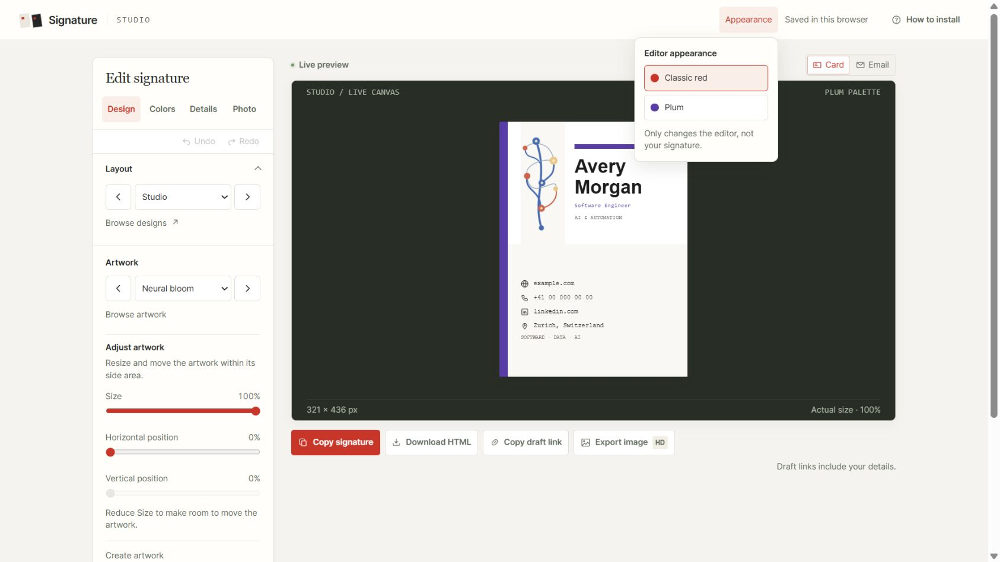

# Artwork controls and editor appearance — 9 September 2026

## Milestone checkpoint

Implementation is complete and frozen at the user's requested stopping point. No further feature work is running. Runtime asset token: `601766014a69fa59`. Delivery is tracked by the repository's CI and Pages workflow for the commit containing this checkpoint.

## What changed

- Design → Artwork now shows **Adjust artwork** directly below the selector. Dots, Orbits, Grid, every other side motif, and custom drawings have Size (25–100% of their fitted maximum) and horizontal/vertical position controls. At a fitted edge, movement disables and the hint explains how reducing size creates room. Abstract backgrounds retain their existing flow controls.
- Four procedural AI-inspired motifs: **Neural bloom**, **Latent field**, **Token weave**, and **Resonance**. They are not AI-generated images.
- **Draw your own** explicitly creates a replacement. **Create with AI** opens the artwork-scoped helper directly, with the new choices and adjustment fields in its prompt. Returned JSON still requires preview and Apply.
- Header → **Appearance** offers Classic red and Plum. Classic red with the dark canvas is the website default. Selection persists separately, closes the menu, and returns keyboard focus. Escape closes it too. Signature colors and the Plum new-signature palette remain unchanged.
- Three optional motif fields preserve older drafts: defaults100/50/0 use the original rendered markup. A custom-grid rounding error found during review was fixed by using its final dimensions once.

## Verification

- Final Windows suite: **239 tests, 238 passed, zero failures, one expected symlink skip**. Eleven new checks cover the reported journey, migration, geometry, assets, and appearance isolation. The independent reviewer also ran100 affected checks.
- The retained custom-grid edge test rejects an in-memory restoration of the old double-fitting call. Neutral PNG, photo, and custom-artwork HTML hashes remain unchanged.
- Real Codex browser: Studio/Tall/Grid changes69×165 to17×41 at25%; moving to the lower right produces59px left and124px top padding. Dots and Orbits respond too. Undo restores the last adjustment and reload preserves the selected motif and settings.
- A64px synthetic image fixture reserves its photo slot while Grid remains adjustable at9×22. No personal photo was used.
- Switching editor appearance and reloading preserved all38 form fields. Red and Plum canvas colors were checked in the DOM.
- At391 CSS pixels, client and scroll widths both371: no horizontal page overflow. Size remained operable, Create with AI opened, and Draw your own cancellation retained the selected artwork. Viewport override was reset. Desktop and phone evidence is interaction/DOM evidence; no claim about exact screenshot compositor geometry.
- Neural bloom generated an inspected1284×1744PNG with Download enabled. Core preview/hosted-HTML parity and export constraints are covered by tests; no downloaded received-email artifact is claimed.
- All20 procedural motif PNGs regenerate deterministically. Existing16 assets remain unchanged; the four new assets are transparent304×728RGBA and reviewed at76×182 and34×82 on light/dark surfaces.
- Strict public build: **69 allowed files**, including four new PNGs. Identical HTML entry points and versioned resources are checked by the retained suite.
- Independent nonblind purpose review approved the scoped desktop fix. Its Appearance dismissal suggestion was implemented and browser-checked. It did not operate the browser itself.

## Remaining limits and resume point

Built-in PNG shapes and inks are fixed; use a custom drawing or AI recipe to replace them for shape/color editing. Size/position controls fit side motifs within the allocated artwork area; they do not turn all patterns into full-card backgrounds. No actual received Gmail/Outlook message was tested in this milestone. No offline package was selected.

Stop after the checkpoint is pushed and deployment is checked. Resume only on a new user request; prioritize any reported regression before adding features.
